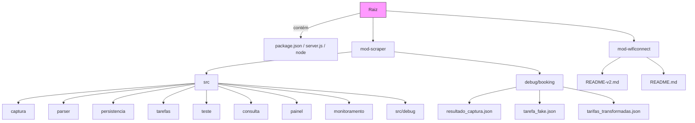

# Arquitetura do app-scraper

Este projeto é dividido em módulos responsáveis por etapas específicas do processo de coleta e análise de dados de tarifas de hotéis.

A separação facilita manutenção, evolução do sistema e eventual divisão futura em serviços independentes.

## Fluxo de dados
        captura
        ↓
        parser
        ↓
        persistencia
        ↓
        consulta
        ↓
        api
        ↓
        painel

## Módulos

### captura
Responsável por executar o scraping.

Funções:
- controle de filas de scraping
- execução com Puppeteer
- retries em caso de erro
- controle de concorrência
- agendamento de tarefas

### parser
Responsável por interpretar o conteúdo capturado.

Funções:
- extrair dados do HTML
- identificar categorias de quarto
- identificar tarifas disponíveis
- normalizar dados para estrutura interna

### persistencia
Responsável por salvar dados no banco.

Funções:
- inserção de tarifas
- controle de histórico
- gravação de logs de scraping

### consulta
Responsável por recuperar dados para análise.

Funções:
- queries para visualização
- cálculo de médias e estatísticas
- comparação entre hotéis

### api
Responsável por expor endpoints HTTP.

Funções:
- fornecer dados ao frontend
- filtros de consulta
- endpoints para monitoramento

### painel
Responsável pela interface web.

Funções:
- visualização de preços
- comparação de hotéis
- relatórios e gráficos

### monitoramento
Responsável por acompanhar execução do sistema.

Funções:
- logs
- status das tarefas
- métricas de execução
- previsão de conclusão de scraping

## Diagrama de Estrutura

_Diagrama simples mostrando pastas e arquivos chave._